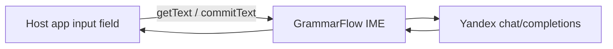

# UX: GrammarFlow Keyboard (IME)

## Принцип

Одна панель действий **над клавишами** — не отдельное приложение для каждой правки.

## Мокап


Тёмная тема, синий accent — в духе десктопного GrammarFlow (`#161e2e`, `#3b82f6`).

## Экраны

### A. Обычный ввод

```text
┌─────────────────────────────────────┐
│  Telegram / поле ввода              │
│  Как дила█                          │
├─────────────────────────────────────┤
│ [✨ Исправить]  [Варианты]  [🌐]    │  ← action bar
├─────────────────────────────────────┤
│  й  ц  у  к  е  н  г  ш  щ  з  х    │
│   ф  ы  в  а  п  р  о  л  д  ж      │
│  ⇧  я  ч  с  м  и  т  ь  б  ю  ⌫    │
│  123     [        пробел      ]  ↵  │
└─────────────────────────────────────┘
```

- **Исправить** — запрос correct API
- **Варианты** — запрос improve API, sheet с карточками
- **🌐** — переключение раскладки RU/EN (MVP: две страницы)

### B. Превью после «Исправить»

```text
┌─────────────────────────────────────┐
│  Как дила█   (исходник в поле)      │
├─────────────────────────────────────┤
│  Как дела          ← подсветка      │
│  [Применить]  [Отмена]              │
├─────────────────────────────────────┤
│  …клавиши…                          │
└─────────────────────────────────────┘
```

**Применить** → `InputConnection` заменяет текст в поле host-приложения.

Подсветка: spans по `errors[].corrected` + difflib fallback (как [`highlight.py`](../../GrammarFlow/ui/highlight.py)).

### C. «Варианты» — sheet

```text
┌─────────────────────────────────────┐
│  Варианты                      [×]  │
│  ┌─────────┐ ┌─────────┐ ┌───────┐  │
│  │Формальн.│ │ Кратко  │ │Творч. │  │
│  │…        │ │…        │ │…      │  │
│  └─────────┘ └─────────┘ └───────┘  │
├─────────────────────────────────────┤
│  клавиши приглушены                 │
└─────────────────────────────────────┘
```

Тап по карточке → подстановка текста в поле.

### D. Онбординг (один раз)

1. Зачем нужна клавиатура GrammarFlow
2. Как включить в **Настройки → Язык и ввод → Клавиатуры**
3. Privacy: текст на сервер **только** по «Исправить» / «Варианты»
4. Кнопка **Открыть настройки** (`ACTION_INPUT_METHOD_SETTINGS`)

## Process Text (вторичный вход)

Выделение в любом app → Process Text / Share → Activity GrammarFlow → результат → Copy.

Для пользователей на Gboard, без смены IME.

## Сравнение с десктопом

| Десктоп | Android IME |
|---------|-------------|
| Alt+C → Bubble | Кнопка на клавиатуре |
| Full: сразу подсветка | Превью → Применить |
| Bubble: Исправить → Правки | Превью в панели IME |
| Ctrl+Shift+Enter варианты | Sheet «Варианты» |

## Поток данных


