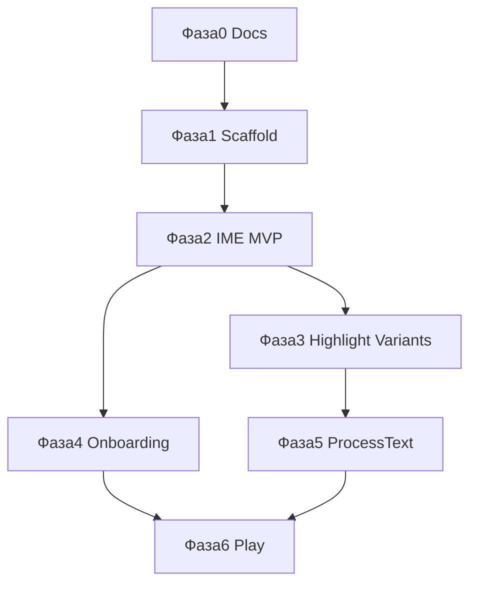

# Roadmap

Оценки — для одного разработчика, знакомого с Android. Параллельно можно вести десктоп в `GrammarFlow/`.

## Фаза 0 — Документация (текущая)

**Срок:** готово  
**Deliverable:** `android/docs/`, AGENTS.md, мокап

- [x] Зачем IME, стек, UX, API-контракт
- [x] Roadmap и privacy

---

## Фаза 1 — Scaffold + настройки

**Срок:** ~1 неделя  
**Deliverable:** Gradle-проект, пустой IME, экран Settings

| Задача | Детали |
|--------|--------|
| Android Studio project | `app` module, minSdk 26 |
| Settings Activity (Compose) | API Key, Folder ID, тест «Ping API» |
| EncryptedSharedPreferences | Сохранение секретов |
| Stub `InputMethodService` | Регистрация в manifest, пустая клавиатура |
| LlmClient (Kotlin) | POST chat/completions, парсинг correct JSON |

**Критерий готовности:** из Settings успешный ping «Как дила» → JSON с `corrected_text`.

---

## Фаза 2 — IME MVP

**Срок:** ~2–3 недели  
**Deliverable:** Рабочая клавиатура + «Исправить»

| Задача | Детали |
|--------|--------|
| Раскладка RU + EN | Базовые клавиши, backspace, space, enter |
| Action bar | Кнопки Исправить / Варианты (Варианты пока stub) |
| Чтение текста поля | `InputConnection.getTextBeforeCursor` / selection |
| Исправить → API → apply | Замена текста через `commitText` / delete + commit |
| Loading / error UI | Индикатор на панели IME |

**Критерий готовности:** в Telegram/Notes набрал «Как дила» → Исправить → «Как дела» в поле.

---

## Фаза 3 — Превью + подсветка + Варианты

**Срок:** ~1–2 недели  
**Deliverable:** UX как в wireframe B и C

| Задача | Детали |
|--------|--------|
| Превью с подсветкой | Spans по `errors[]`, fallback diff |
| Применить / Отмена | Не менять поле до «Применить» |
| Improve API | Sheet с 3 карточками |
| Выбор варианта | Подстановка в поле |

**Критерий готовности:** полный цикл correct + improve с UI.

---

## Фаза 4 — Онбординг + Privacy

**Срок:** ~3–5 дней  
**Deliverable:** Первый запуск, Play-ready copy

| Задача | Детали |
|--------|--------|
| Onboarding wizard | Включить IME, privacy экран |
| Privacy policy текст | «Текст на сервер только по кнопке» |
| Deep link в настройки клавиатуры | `ACTION_INPUT_METHOD_SETTINGS` |

**Критерий готовности:** новый пользователь проходит онбординг без документации.

---

## Фаза 5 — Process Text

**Срок:** ~3–5 дней  
**Deliverable:** Activity для выделенного текста

| Задача | Детали |
|--------|--------|
| `PROCESS_TEXT` intent filter | `text/plain` |
| Экран результата | Correct + copy |
| Share target (optional) | «Поделиться → GrammarFlow» |

**Критерий готовности:** выделил в браузере → Исправить без смены клавиатуры.

---

## Фаза 6 — Polish + Play

**Срок:** ~1–2 недели  
**Deliverable:** Internal testing / closed track

| Задача | Детали |
|--------|--------|
| Иконка, splash, название | GrammarFlow Keyboard |
| Темы (dark/light) | Согласовать с мокапом |
| Обработка edge cases | WebView fields, пустой текст, offline |
| Play Console listing | Скриншоты, privacy form для IME |
| Beta | Internal / closed testing |

---

## Сводная шкала

| Фаза | Недели (накоп.) |
|------|-----------------|
| 1 Scaffold | 1 |
| 2 IME MVP | 3–4 |
| 3 Highlight + Variants | 4–6 |
| 4 Onboarding | 5–6 |
| 5 ProcessText | 5–7 |
| 6 Polish | 6–8 |

**MVP для себя:** фазы 1–3 (~4–6 недель).  
**Публикация в Play:** фазы 1–6 (~6–8 недель).

## Зависимости между фазами

## Вне scope (backlog)

- Floating bubble overlay
- Swipe-typing, голосовой ввод
- iOS (отдельный проект)
- OpenRouter / другие провайдеры
